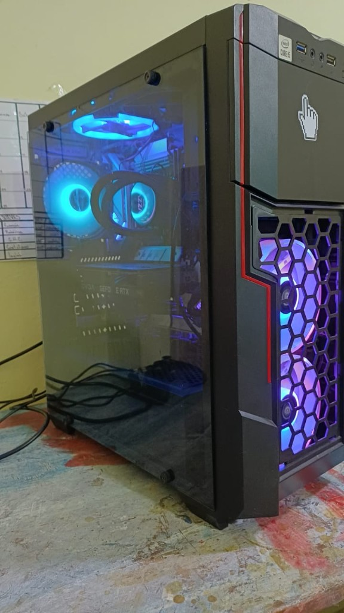

# guasimo

[](https://github.com/hrodrig/guasimo/releases)
[](https://github.com/hrodrig/guasimo/releases)
[](./LICENSE)
[](https://www.gnu.org/software/bash/)
[](https://ubuntu.com/)
[](https://developer.nvidia.com/cuda-zone)
[](https://gghstats.hermesrodriguez.com/hrodrig/guasimo)

**Repo:** [github.com/hrodrig/guasimo](https://github.com/hrodrig/guasimo) · **Releases:** [Releases](https://github.com/hrodrig/guasimo/releases)


**G**raphical **U**tility for **A**I **S**erver **I**nference of **M**odels, **O**pen-source.

A self-hosted local LLM coding workstation. One command takes a fresh Ubuntu 26.04 box to a browser chat UI and an OpenAI-compatible API for your IDE. Models stay on the machine — nothing leaves the box.

## Table of contents

- [Why guasimo](#why-guasimo)
- [Features](#features)
- [Prerequisites](#prerequisites)
- [Quick start](#quick-start)
- [Stack](#stack)
- [Hardware target](#hardware-target)
- [Status](#status)
- [Documentation](#documentation)
- [Repository layout](#repository-layout)
- [Contributing](#contributing)
- [License](#license)

## Why guasimo

- **Local by default** — inference and model blobs stay on your hardware; no cloud round-trip for code.
- **One install path** — `deploy/install.sh` detects GPU, builds llama.cpp, and wires systemd + nginx TLS.
- **IDE-ready API** — Ollama exposes an OpenAI-compatible HTTP surface for Cursor, Continue, and friends.
- **Built for coding** — primary focus is generation, review, explanation, and translation across Go, C#, and DevOps tooling.

## Features

- Dual inference path: NVIDIA CUDA when `nvidia-smi` is ready; CPU fallback always available
- Deferred CUDA build after a fresh driver install (re-run `install.sh` post-reboot)
- systemd units for the stack; nginx terminates TLS on `:443` (self-signed by default)
- `healthcheck.sh`, `pull-models.sh`, and `benchmark.sh` for day-one validation
- Optional model nicknames (e.g. `gemma`, `deepseek`) on top of the primary code model
- Docs-first contract: `SPECIFICATIONS.md` + `docs/` stay authoritative

## Prerequisites

- **OS:** Ubuntu 26.04 (validated target)
- **GPU:** NVIDIA with working driver preferred (reference box: RTX 3060 12 GB). CPU-only still works, slower.
- **Disk:** room for GGUF blobs (primary pull is on the order of ~10 GB)
- **Pre-flight:** if `nvidia-smi` is missing, add the NVIDIA CUDA apt repo first — see [docs/05-deployment.md](docs/05-deployment.md)

## Quick start

On the Ubuntu target machine:

```bash
git clone https://github.com/hrodrig/guasimo.git ~/guasimo
cd ~/guasimo
sudo ./deploy/install.sh          # detects GPU, builds llama.cpp, wires systemd
./scripts/healthcheck.sh
./scripts/pull-models.sh primary  # ~10 GB primary code model
./scripts/benchmark.sh primary    # validates tokens/s on this box
```

Open `https://localhost/` (self-signed cert — accept in the browser).  
Open WebUI listens on loopback `:8080`; nginx terminates TLS on `:443`.

## Stack

| Layer | Role |
|-------|------|
| **llama.cpp** | Inference engine (server mode), compiled on the box |
| **Ollama** | Model lifecycle + OpenAI-compatible HTTP API |
| **Open WebUI** | Chat UI (systemd), fronted by nginx + TLS |

A model is a named recipe + a GGUF blob. Ollama owns the recipe; llama.cpp does the maths; Open WebUI does the chat. Each layer can be swapped without breaking the others.

## Hardware target

Validated on a **real reference workstation** (not a cloud VM):



| Component | Spec | Role |
|-----------|------|------|
| CPU | Intel i5-10xxx (Comet Lake-S) | Fallback inference; CPU build of llama.cpp |
| GPU | NVIDIA RTX 3060 (12 GB VRAM) | Primary inference; CUDA build of llama.cpp |
| RAM | 32 GB DDR4 | KV cache, OS, IDE, browser |
| Storage | 2 TB SSD + 500 GB NVMe | Cold GGUF store + hot runtime/models/logs |
| OS | Ubuntu 26.04 | LTS kernel, modern CUDA 12.x packages |

Details and trade-offs: [docs/02-hardware-decisions.md](docs/02-hardware-decisions.md).

## Status

**v0.2.2** — install + primary pull + healthcheck (8/0) + benchmark (~18 gen tok/s) + LAN chat UI validated on Ubuntu 26.04 + RTX 3060 (2026-07-31 / 2026-08-01). Hermes Agent docs; optional `gemma` / `deepseek` pulls. History: [CHANGELOG.md](CHANGELOG.md). Roadmap: [docs/09-roadmap.md](docs/09-roadmap.md).

## Documentation

| Doc | Purpose |
|-----|---------|
| [SPECIFICATIONS.md](SPECIFICATIONS.md) | Scope and contract for v1 |
| [docs/00-index.md](docs/00-index.md) | Docs map and reading order |
| [docs/05-deployment.md](docs/05-deployment.md) | What `install.sh` does, CUDA pre-flight |
| [docs/08-troubleshooting.md](docs/08-troubleshooting.md) | Common failures |
| [docs/09-roadmap.md](docs/09-roadmap.md) | Near-term plans |
| [CHANGELOG.md](CHANGELOG.md) | Per-version release notes |

## Repository layout

```
docs/                   Technical documentation (English)
deploy/                 Systemd units, nginx vhosts, install/uninstall scripts
config/                 Ollama Modelfiles and llama.cpp server config
scripts/                Operations: benchmark, healthcheck, log rotation, etc.
tests/                  End-to-end smoke + per-language prompt suites
SPECIFICATIONS.md       Scope and contract for v1
CHANGELOG.md            Per-version release notes
```

## Contributing

Issues and PRs welcome. Keep project docs in **English**. Operational changes should stay consistent with `SPECIFICATIONS.md` and `docs/`.

## License

[MIT](./LICENSE)
