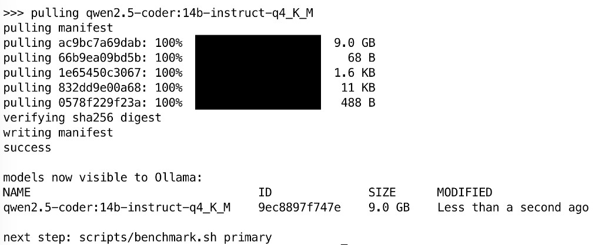

# 04 — Models

## Selection criteria

For a coding LLM on a 32 GB CPU box we want:

1. **Strong on real programming tasks**, not just chat.
2. **Quantisation-friendly**: Q4_K_M should preserve ≥ 95 % of FP16 quality.
3. **Open licence** (Apache-2.0 / MIT / etc.) so we can self-host freely.
4. **Active maintenance** in 2025–2026, with regular code-specialised
   fine-tunes.

## Primary model — Qwen2.5-Coder-14B-Instruct (Q4_K_M)

| Attribute         | Value                                       |
|-------------------|---------------------------------------------|
| Family            | Qwen2.5-Coder                               |
| Size              | 14 B parameters                             |
| Quantisation      | Q4_K_M (4-bit, K-quant, medium)             |
| Disk              | ~9 GB                                       |
| RAM at inference  | ~10 GB (weights + KV cache, 8K ctx)         |
| Context window    | 128 K (we use 8–32 K; longer costs RAM)     |
| Licence           | Apache-2.0                                  |
| Why               | Best-in-class for code at this size in 2026 |

This is the daily driver. Use it for code completion, refactor, review,
explanation, docstring writing, and language translation between Go ↔ C#.

### Validated pull (Ubuntu 26.04 + RTX 3060)

Real capture after `./scripts/pull-models.sh primary` (2026-08-01):
registry layers verified, manifest written, model listed as 9.0 GB.

Same session: `./scripts/healthcheck.sh` → **8 ok / 0 fail**;
`./scripts/benchmark.sh primary` → ~**18** gen tok/s, ~**4** prompt
tok/s (200 gen tokens, ~57 s wall).

## Secondary model — Qwen2.5-Coder-7B-Instruct (Q4_K_M)

| Attribute         | Value                                       |
|-------------------|---------------------------------------------|
| Size              | 7 B parameters                              |
| Quantisation      | Q4_K_M                                      |
| Disk              | ~5 GB                                       |
| RAM               | ~6 GB                                       |
| Licence           | Apache-2.0                                  |
| Why               | Fast responses, fits comfortably with 14 B also loaded |

Use this for quick autocompletion-style prompts where the larger model
would feel sluggish.

## Large model — Qwen2.5-Coder-32B-Instruct (Q4_K_M) — optional

Only useful with partial CPU offload. The Q4 GGUF is ~20 GB and the RTX
3060 only has 12 GB of VRAM, so the 14 B model is the right primary.
The 32 B variant is pulled on demand via `scripts/pull-models.sh large`
for cases where the larger context window or stronger long-form reasoning
is worth the speed hit.

## Optional — Gemma 4 12B (`gemma`)

| Attribute         | Value                                       |
|-------------------|---------------------------------------------|
| Ollama tag        | `gemma4:12b`                                |
| Nickname          | `./scripts/pull-models.sh gemma`            |
| Disk              | ~8 GB                                       |
| Self-host 3060    | Yes at Q4; 8–16K ctx comfortable; 64K tight |
| Licence           | Apache-2.0 (Gemma 4)                        |
| Why               | Strong tool-calling / agent UX; multimodal  |

Not the daily coding driver (Qwen2.5-Coder still wins on pure code), but
a good alternate for Hermes Agent and Open WebUI tool workflows. Prefer
this or `secondary` (7B coder) when 14B @ Hermes’ 64K floor feels too
slow.

## Optional — DeepSeek-Coder-V2-Lite (`deepseek`)

| Attribute         | Value                                       |
|-------------------|---------------------------------------------|
| Ollama tag        | `deepseek-coder-v2:lite` (~8.9 GB, MoE)     |
| Nickname          | `./scripts/pull-models.sh deepseek`         |
| Self-host 3060    | Yes                                         |
| Licence           | DeepSeek licence (open weights; check card) |
| Why               | Strong coding backup; different training    |

Pull when you want a second opinion vs Qwen on hard refactors. Alias
`deepseek-lite` accepted by the pull/benchmark scripts.

## Why Qwen2.5-Coder, not Llama / Mistral / …

| Model family              | Coding (self-host focus) | Self-host on RTX 3060 (12 GB)? | Verdict |
|---------------------------|--------------------------|--------------------------------|---------|
| Qwen2.5-Coder-14B-Instruct| High                     | Yes, comfortably (Q4 @ 8K)     | Primary |
| Qwen2.5-Coder-7B-Instruct | High / fast              | Yes                            | Secondary |
| Gemma 4 12B               | High (agents / tools)    | Yes (64K tight)                | Optional `gemma` |
| DeepSeek-Coder-V2-Lite    | Medium-high              | Yes                            | Optional `deepseek` |
| Llama-3.1-8B-Instruct     | Medium                   | Yes, fast                      | Niche   |
| Mistral-Codestral-22B     | High                     | Yes, tight                     | Considered |
| CodeLlama-70B             | High                     | No (needs ≥ 40 GB)             | Excluded |
| Bonsai (1-bit)            | Weak on code             | Tiny, but Ollama/Q1_0 friction | Out of scope |

The Qwen2.5-Coder family remains the default coding stack; Gemma and
DeepSeek are opt-in pulls for agents and cross-checks.

## Modelfiles

Each named model is a `Modelfile` in `config/ollama/`. A Modelfile specifies
the base GGUF, the chat template, the system prompt, and sampling defaults.

Examples in this repo:

- `config/ollama/Modelfile.coder-14b`
- `config/ollama/Modelfile.coder-7b`

Both inherit the system prompt `config/ollama/PROMPT.coding.md` so behaviour
is consistent across sizes.

## Sampling defaults

For coding we want low temperature (deterministic-ish) and top-p clamped
narrow:

    temperature        0.2
    top_p              0.95
    top_k              40
    repeat_penalty     1.05
    num_ctx            8192   # 32 K for the longer-context variant

For brainstorming / doc writing the same Modelfile can be invoked with
override parameters via the API. Defaults are conservative.

## How to add a new model

1. Drop the GGUF into `/bulk/models/<vendor>-<name>-<size>-<quant>.gguf`.
2. Add a `Modelfile.<name>` in `config/ollama/` that points at it.
3. `ollama create <name> -f config/ollama/Modelfile.<name>`.
4. Verify with `./scripts/benchmark.sh <name>`.
5. Document in `docs/04-models.md` (this file) under a new heading.

This is intentionally a 5-step process; the friction prevents stale
models from accumulating.

## What we explicitly do not pull

- Any model with a non-open licence.
- Any "uncensored" fine-tune — for code use, the standard instruct
  response is correct.
- Models > 70 B. Out of the box's reach.
- Models without a GGUF quantisation available — building one ourselves
  is possible but out of scope for v1.