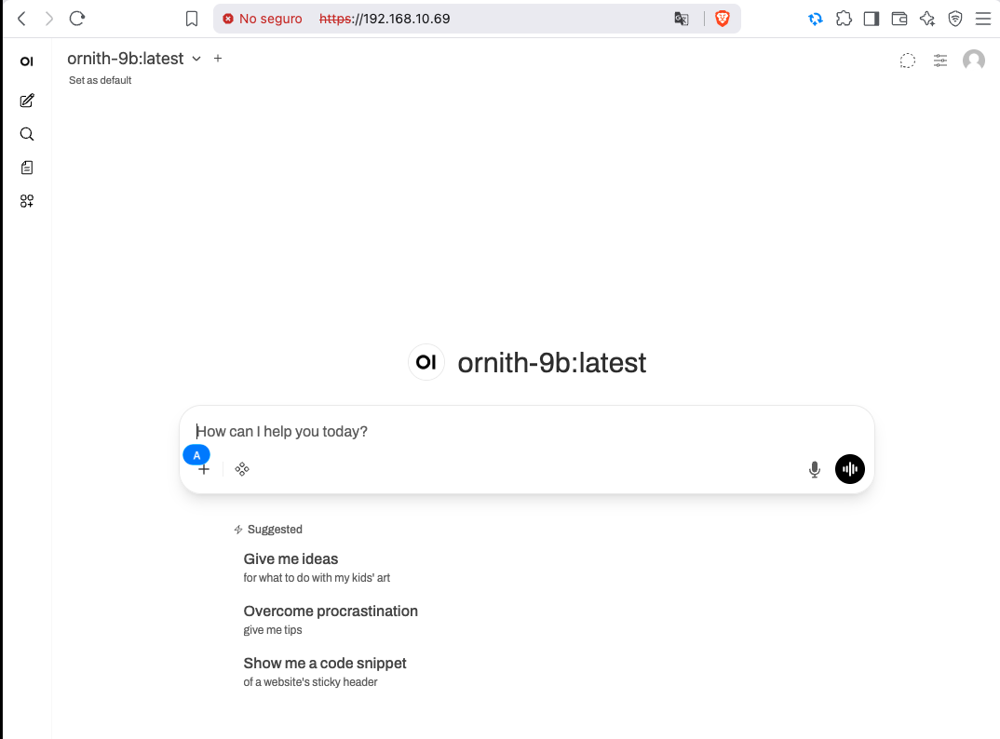

# 06 — Networking and security

## Threat model

This is a **single-user workstation on a trusted LAN**. The threat model is
"casual visitor on the Wi-Fi", not "nation-state adversary". We optimise
for: don't accidentally expose the model to the internet, don't let
browsers cache tokens, don't run the services as root.

Out of scope: zero-trust networking, mutual TLS, HSM, audit-grade logging,
DLP.

## Listening sockets (default)

| Service       | Bind                | Port (tcp) | TLS   |
|---------------|---------------------|------------|-------|
| llama-server  | 127.0.0.1           | 8081       | No    |
| Ollama        | 127.0.0.1           | 11434      | No    |
| Open WebUI    | 127.0.0.1           | 8080       | No    |
| nginx         | 0.0.0.0             | 80, 443    | Yes (443) |

The inference services bind to loopback only. nginx is the only service
listening on the LAN-facing side. nginx terminates TLS and reverse-proxies
to Open WebUI.

This means:

- IDE plugins on the same host use `http://127.0.0.1:11434/v1/...` directly.
- LAN browsers use `https://<hostname>/` (or LAN IP).
- The model API is never exposed to the LAN, only to Open WebUI on
  loopback.

### Validated LAN access (2026-08-01)

Reference box at `192.168.10.69`: browser on another LAN host opened
`https://192.168.10.69/` (self-signed → "Not secure" warning expected),
Open WebUI with the v0.2.x primary `qwen2.5-coder:14b-instruct-q4_K_M`
selected. The v0.3.0 primary alias (`qwen3-27b`) is now pre-selected as
the chat model default via `DEFAULT_MODELS=qwen3-27b` in
`deploy/systemd/open-webui.service`; the chat endpoint, the
`OPENAI_API_BASE_URL`, and the TLS termination do not change.



## Clients on another LAN host (Hermes Agent, IDE plugins)

Same subnet does **not** expose Ollama. The API stays on loopback of the
guasimo box. From a Mac / laptop on the LAN:

1. Forward the API (leave this session open):

       ssh -N -L 11434:127.0.0.1:11434 <user>@<guasimo-lan-ip>

2. Point the client at the tunnel, not at nginx and not at the LAN IP:

   | Wrong                         | Right                              |
   |-------------------------------|------------------------------------|
   | `https://192.168.x.x/`        | Open WebUI only                    |
   | `http://192.168.x.x:11434`    | refused (loopback-only)            |
   | `http://127.0.0.1:1234/v1`    | LM Studio default, not guasimo     |
   | `http://127.0.0.1:11434/v1`   | Ollama OpenAI-compat via tunnel    |

3. Verify from the client machine:

       curl -sS http://127.0.0.1:11434/v1/models

### Hermes Agent (Nous Research)

Hermes talks OpenAI-compat. Use a **custom** endpoint (not "Local :1234"):

    hermes model
    # Custom endpoint
    # API base URL: http://127.0.0.1:11434/v1
    # API key: ollama   (or blank)
    # Model: qwen3-27b

Or `~/.hermes/config.yaml`:

```yaml
model:
  provider: custom
  base_url: http://127.0.0.1:11434/v1
  default: qwen3-27b                  # v0.3.0 primary Modelfile alias
  context_length: 65536
  ollama_num_ctx: 65536               # required by Hermes v0.19+ for tool use
agent:
  reasoning_effort: none              # coder instruct ≠ thinking model
```

The `default` model name points at the Modelfile alias created by
`scripts/install-aliases.sh`, not the raw `qwen3.8:27b` Ollama tag.
Both names work; the alias is what the system prompt and sampling
defaults are baked into.

**Context floor:** Hermes Agent rejects runtime context below **64 000**.
The Modelfile ships with `num_ctx 32768`; raise it per-request via
`ollama_num_ctx` (and the server-side `OLLAMA_CONTEXT_LENGTH` env if
you want it persistent across model loads). GGUF metadata may still
show 32 768 — ignore that for Hermes. Details:
`docs/08-troubleshooting.md` → *Hermes Agent: context below 64K*.

**Thinking / HTTP 400:** if Ollama returns `does not support thinking`,
keep the same model and set `agent.reasoning_effort: none` (see
troubleshooting). The v0.3.0 primary has thinking on by default at
the model level; the `qwen3-27b` Modelfile alias uses the non-thinking
chat template, which is what Hermes expects.

**Speed on RTX 3060:** Hermes' 64K floor + 27B partial offload is
**slow** (~2-4 tok/s). For agent loops prefer the secondary
(`qwen2.5-coder:7b-instruct-q4_K_M`, full VRAM, ~25-30 tok/s), the
thinking alias only when you need the audit trail, or `gemma` /
`deepseek` for non-Qwen paths. Keep `primary` (qwen3-27b) for review
and refactor where quality matters more than latency.

**Multimodal:** the v0.3.0 primary accepts image input. The Open
WebUI UI forwards image attachments to the model; the OpenAI-compat
API exposes them as `image_url` content parts. Out of the LAN surface
this is fine (LAN only, single user); see "Logging hygiene" below for
how image attachments are kept off `/var/log/guasimo/`.

Upstream: [Hermes providers](https://hermes-agent.nousresearch.com/docs/integrations/providers),
[Ollama ↔ Hermes](https://docs.ollama.com/integrations/hermes).

## TLS

- `deploy/install.sh` generates a self-signed cert for the hostname at
  install time so first-run UX is "open https://<hostname>/ and accept the
  cert".
- Production should swap the cert for one issued by an internal CA or by
  Let's Encrypt. The swap is documented in `docs/09-roadmap.md`.
- TLS config in nginx is the Mozilla "intermediate" profile (no TLS 1.0/1.1,
  strong ciphers, HSTS off by default to avoid lock-in for the LAN).

## Authentication

- Open WebUI is configured for single-user mode (first account created
  becomes admin).
- No password reset flow; recovery is "ssh in, delete the SQLite user row".
- Open WebUI handles session cookies. nginx adds no auth layer; adding one
  would only complicate the proxy and add nothing if the LAN is trusted.

## Firewall

By default, the install **does not** open any firewall ports. The operator
must run `scripts/open-firewall.sh` explicitly:

    ufw allow from 192.168.0.0/16 to any port 443 proto tcp

That script is a thin wrapper around `ufw` and prints the rule before
applying. It never opens ports to `0.0.0.0`.

If `ufw` is inactive, the script informs the operator and exits non-zero.
We do not silently enable a firewall.

## Sandbox / privilege

- The three services run as a dedicated unprivileged user `guasimo` created
  by `install.sh`, not as root.
- `guasimo` has write access to `/data/models`, `/bulk/models`, `/var/log/guasimo`.
- No service gets sudo. No service has CAP_NET_BIND_SERVICE except nginx
  (which already binds 443 as a systemd-managed process).

## What the install script does NOT do

- Set up Let's Encrypt.
- Configure a reverse proxy other than nginx.
- Open ports automatically.
- Pull or store any credentials.

## Logging hygiene

- Inference logs (prompts, completions) are written to
  `/var/log/guasimo/` with mode `0640`, owner `guasimo:adm`.
- Log rotation is handled by `scripts/rotate-logs.sh` (cron'd weekly). We
  do not use `logrotate` for these files because the format is not
  syslog-native and we'd rather have one tool to look at.
- We do not log full prompts by default — only request ID, model, token
  counts, and latency. Full prompt logging is opt-in via env var.

## Backups

Inference config and recipes (`config/`, `deploy/`, `docs/`) are in the
git repo. Models are not; they are reproducible from upstream pulls.

For disaster recovery:

- `git clone` the repo.
- Re-run `deploy/install.sh`.
- Re-run `scripts/pull-models.sh primary secondary`.

Total restore time: download speed × (9 GB + 5 GB) + ~10 min setup.