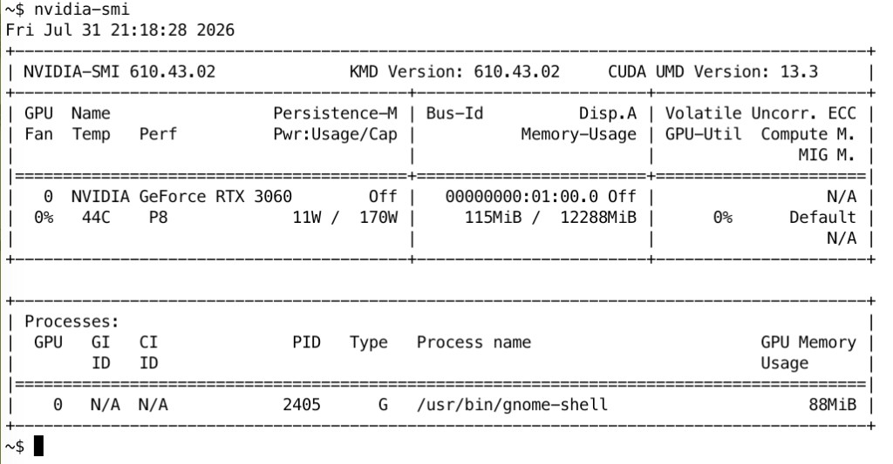

# 08 — Troubleshooting

## Triage order

Always go through these in order. Skipping ahead wastes time.

1. **Is the host up?** `ping`, `ssh`. If no, it's not an LLM problem.
2. **Are the systemd units active?**
   `systemctl status ollama open-webui nginx`.
3. **Is the model loaded?** `curl http://127.0.0.1:11434/api/tags | jq`.
4. **Does the API respond?** `curl http://127.0.0.1:11434/v1/models`.
5. **Does the web UI load?** `curl -I http://127.0.0.1:8080`.

The problem lives at whichever step first fails.

## Symptom: "Connection refused" on 11434

Ollama is not running.

    systemctl status ollama
    sudo journalctl -u ollama -n 50 --no-pager

Common causes:

- First boot, `guasimo.target` not enabled: `sudo systemctl enable --now guasimo.target`.
- `OLLAMA_LLAMA_SERVER` override points at a missing binary. Check
  `/etc/systemd/system/ollama.service.d/override.conf`.
- Port collision: `ss -ltnp 'sport = :11434'`.

## Symptom: `mkdir /data/models/blobs: permission denied`

Ollama's systemd unit runs as user `ollama`. `/data/models` must be
owned by that user (not `guasimo`). Typical after a bad chown or a
power-loss recovery where paths were recreated as the wrong owner:

    sudo mkdir -p /data/models /bulk/models
    sudo chown -R ollama:ollama /data/models /bulk/models
    sudo chmod 755 /data /bulk /data/models /bulk/models
    sudo systemctl reset-failed ollama
    sudo systemctl restart ollama
    systemctl is-active ollama

Then resume the pull (Ollama resumes incomplete blobs when possible):

    ./scripts/pull-models.sh primary

## Symptom: Ollama running, model not loaded

    ollama pull <name>
    ollama list

If `ollama pull` fails with a 404, the model name in the Modelfile is
wrong. Check `config/ollama/Modelfile.<name>` and confirm the `FROM`
line.

If `ollama pull` fails with a network error, check DNS and HTTP proxy.
Ollama pulls from `registry.ollama.ai` by default.

## Symptom: model loaded, but responses are slow (>2 tok/s drop)

- CPU thermal throttle? `sensors | grep Core` (install `lm-sensors`).
- Wrong SIMD build? The install log should say "AVX2" or "AVX-512". If it
  says "fallback", rebuild.
- Another process eating CPU: `htop`.
- KV cache thrash: context length set too high. Drop `num_ctx` to 4096 and
  retry.

## Symptom: OOM kill in dmesg

    dmesg | grep -i 'killed process'

Inference is over-budget. Either:

- Drop to a smaller model (7 B instead of 14 B).
- Lower `num_ctx`.
- Reduce concurrent requests (Ollama's `num_parallel`).

A 32 GB system should not OOM on a single 14 B Q4 model with 8K context.
If it does, something else is resident — `ps aux --sort -%mem | head`.

## Symptom: nginx 502 to Open WebUI

Open WebUI crashed or is still starting.

    sudo journalctl -u open-webui -n 50 --no-pager

If the venv is broken (e.g. after a Python upgrade), re-run
`/opt/guasimo/webui-venv/bin/pip install -U -r requirements.txt`.

## Symptom: TLS errors in browser

The cert is self-signed. The browser will warn. Click through for v1, or
replace the cert per `docs/06-networking-and-security.md`.

## Symptom: `nginx: cannot load certificate …/guasimo/fullchain.pem`

First-install race: `nginx -t` ran before the self-signed cert was
created. Fixed in `install.sh` (cert first, then `nginx -t`). Manual
recovery without a full re-run:

    sudo mkdir -p /etc/nginx/ssl/guasimo
    sudo openssl req -x509 -nodes -newkey rsa:2048 -days 365 \
      -subj "/CN=$(hostname -f)" \
      -keyout /etc/nginx/ssl/guasimo/privkey.pem \
      -out /etc/nginx/ssl/guasimo/fullchain.pem
    sudo chmod 600 /etc/nginx/ssl/guasimo/privkey.pem
    sudo nginx -t && sudo systemctl enable --now nginx && sudo systemctl reload nginx

## Symptom: `No matching distribution found for open-webui==…`

Ubuntu 26.04's system `python3` is 3.13+. Open WebUI still declares
`Requires-Python >=3.11,<3.13`, so pip on a 3.13 venv ignores every
release (including the pin) and reports "from versions: none".

There is also no `python3.12` package in the Ubuntu 26.04 archive.
`install.sh` bootstraps [uv](https://github.com/astral-sh/uv) under
`/opt/guasimo/uv`, installs CPython 3.12 into `/opt/guasimo/python`, and
builds the WebUI venv with that interpreter. Manual recovery:

    sudo rm -rf /opt/guasimo/webui-venv
    sudo ./deploy/install.sh

## Symptom: `Unable to locate package python3.12`

Expected on Ubuntu 26.04 — the archive only ships 3.13+. Do not add
random PPAs; let `install.sh` provision 3.12 via uv (see above).

## Symptom: pip downloads `torch` + `nvidia-*-cu13` for hundreds of MB

Open WebUI's pip package depends on `sentence-transformers` / Whisper,
which pull **PyTorch**. The default Linux torch wheel also pulls pip
`nvidia-cudnn-cu13`, `nvidia-nccl-cu13`, etc. — separate from the host
NVIDIA driver you already installed for Ollama/llama.cpp. Inference
does **not** use those pip CUDA libs; they only waste disk and time.

`install.sh` pre-installs **CPU-only** torch from
`https://download.pytorch.org/whl/cpu` before `open-webui`, so the
resolver skips the CUDA companion wheels. You still get a large
download (torch CPU + open-webui itself ~100 MB+), but not another
copy of the CUDA stack.

If a previous run already filled the venv with CUDA torch:

    sudo rm -rf /opt/guasimo/webui-venv
    sudo ./deploy/install.sh

There is no official `open-webui[min]` on PyPI yet (upstream discussion
only). For this stack the UI talks to Ollama; local GPU torch is not
required.

## Symptom: llama.cpp build fails with `uint32_t` does not name a type

On Ubuntu 26.04 (GCC 15), building pinned llama.cpp `b4568` dies in
`src/llama-mmap.h`:

```
error: ‘uint32_t’ does not name a type
   26 |     uint32_t read_u32() const;
note: ‘uint32_t’ is defined in header ‘<cstdint>’; this is probably
      fixable by adding ‘#include <cstdint>’
```

GCC 15 stopped leaking fixed-width types through `<vector>` /
`<memory>`. Upstream fixed it in ggml-org/llama.cpp#11796; our pin is
older. `install.sh` patches the header after clone when `<cstdint>` is
missing.

Manual recovery if you hit this mid-build:

    sudo sed -i '/#pragma once/a\
\
#include <cstdint>' /opt/guasimo/llama.cpp/src/llama-mmap.h
    sudo ./deploy/install.sh

Or one-shot rebuild without re-running the full install:

    cd /opt/guasimo/llama.cpp
    sudo cmake --build build --parallel

## Symptom: NVIDIA GPU detected but ignored

`install.sh` only enables CUDA when `nvidia-smi` works **as a non-root
user**. If the driver is installed but `nvidia-smi` requires root, fix the
driver:

    sudo usermod -aG video $LOGNAME
    newgrp video
    nvidia-smi

Re-run `install.sh`. Phase 1 will re-detect.

## Symptom: `Sub-process /usr/bin/dpkg returned an error code (1)` during install

The NVIDIA driver unpack failed on packages like `nvidia-firmware-610`,
`libnvidia-cfg1-610`, `libnvidia-gl-610`. The most common cause is a
`dpkg` database left half-configured by a previous interrupted run
(Ctrl-C, power loss, or an earlier failed driver install).

`install.sh` now repairs this automatically at the start of phase 2
(`dpkg --configure -a` + `apt-get -f install`), and the driver failure
no longer kills the whole install — the box falls back to a CPU build
of `llama.cpp` for that run. To retry CUDA:

    sudo dpkg --configure -a
    sudo apt-get -f install
    sudo apt-get install -y nvidia-driver-610   # or whatever apt-cache found
    sudo reboot
    sudo ./deploy/install.sh                    # re-run to enable CUDA

If the driver unpack still fails after the repair, look for:

- An older driver still installed: `dpkg -l | grep nvidia-driver` and
  `sudo apt-get remove --purge nvidia-driver-*` (keep the one you want).
- Secure Boot / MOK enrollment blocking the kernel module: the driver
  package unpacks but the module never loads. `mokutil --sb-state` tells
  you. Enroll the MOK or disable Secure Boot.
- Out of space on `/`: `df -h /`. The driver packages are large.

After the driver loads (`nvidia-smi` works as a non-root user), re-run
`install.sh`. Phase 3 will build the CUDA variant.

## Symptom: `trying to overwrite` between `nvidia-firmware` and `nvidia-firmware-610`

Validated on Ubuntu 26.04 (`resolute`) with RTX 3060 during the first
real `install.sh` run (2026-07-31). This is **not** a half-configured
dpkg database — it is a packaging-scheme collision. `apt-get -f install`
alone cannot fix it.

### Root cause

Two packaging schemes ship the same NVIDIA files under different package
names:

| Scheme | Source | Version suffix | Example packages |
|--------|--------|----------------|------------------|
| Unversioned | Ubuntu archive | `…-1ubuntu1` | `nvidia-firmware`, `libnvidia-cfg1`, `libnvidia-egl-wayland21` |
| Versioned | NVIDIA CUDA repo | `…-0ubuntu0.26.04.1` | `nvidia-firmware-610-*`, `libnvidia-cfg1-610`, `libnvidia-gl-610` |

Shared paths (examples):

- `/lib/firmware/nvidia/610.43.02/gsp_ga10x.bin`
- `/usr/lib/x86_64-linux-gnu/libnvidia-cfg.so.610.43.02`
- `/usr/lib/x86_64-linux-gnu/libnvidia-egl-wayland2.so.1.0.1`

How the box gets stuck: an earlier install left the unversioned Ubuntu
packages; later `nvidia-driver-610` from the CUDA repo (or a partial
install) needs the versioned siblings. dpkg refuses the overwrite → apt
reports unmet Depends forever.

### How it looks in the wild

Real console excerpts from Ubuntu 26.04 / driver 610.43.02 (2026-07-31).

**Phase A — unmet Depends after a half-broken install:**

```
nvidia-driver-610 is already the newest version (610.43.02-0ubuntu0.26.04.1).
nvidia-cuda-toolkit is already the newest version (12.4.131~12.4.1-8).
You might want to run 'apt --fix-broken install' to correct these.
The following packages have unmet dependencies:
 nvidia-dkms-610 : Depends: nvidia-firmware-610-610.43.02 but it is not going to be installed
 nvidia-driver-610 : Depends: libnvidia-gl-610 (= 610.43.02-0ubuntu0.26.04.1) but it is not going to be installed
                     Depends: libnvidia-cfg1-610 (= 610.43.02-0ubuntu0.26.04.1) but it is not going to be installed
 nvidia-kernel-common-610 : Depends: nvidia-firmware-610-610.43.02 but it is not going to be installed
 xserver-xorg-video-nvidia-610 : Depends: libnvidia-cfg1-610 (= 610.43.02-0ubuntu0.26.04.1) but it is not going to be installed
E: Unmet dependencies. Try 'apt --fix-broken install' with no packages (or specify a solution).
```

**Phase B — `apt-get -f install` hits the file collision:**

```
Preparing to unpack …/nvidia-firmware-610-610.43.02_610.43.02-0ubuntu0.26.04.1_amd64.deb…
dpkg: error processing archive …/nvidia-firmware-610-610.43.02_….deb (--unpack):
 trying to overwrite '/lib/firmware/nvidia/610.43.02/gsp_ga10x.bin', which is also in package nvidia-firmware (610.43.02-1ubuntu1)
Preparing to unpack …/libnvidia-gl-610_610.43.02-0ubuntu0.26.04.1_amd64.deb…
dpkg: error processing archive …/libnvidia-gl-610_….deb (--unpack):
 trying to overwrite '/usr/lib/x86_64-linux-gnu/libnvidia-egl-wayland2.so.1.0.1', which is also in package libnvidia-egl-wayland21:amd64 (1.0.1-1ubuntu1)
Preparing to unpack …/libnvidia-cfg1-610_610.43.02-0ubuntu0.26.04.1_amd64.deb…
dpkg: error processing archive …/libnvidia-cfg1-610_….deb (--unpack):
 trying to overwrite '/usr/lib/x86_64-linux-gnu/libnvidia-cfg.so.610.43.02', which is also in package libnvidia-cfg1:amd64 (610.43.02-1ubuntu1)
E: Sub-process /usr/bin/dpkg returned an error code (1)
```

**Phase C — `apt-get remove --purge` does NOT work** while the graph is
broken (packages stay installed; same unmet Depends message as Phase A).

### Fix (prefer versioned CUDA-repo scheme)

Bypass apt's resolver with `dpkg`, then let apt finish the graph:

    sudo dpkg --purge --force-depends \
      nvidia-firmware libnvidia-cfg1 libnvidia-egl-wayland21 \
      libnvidia-egl-xcb1 libnvidia-egl-xlib1 libnvidia-gpucomp \
      nvidia-modprobe
    sudo apt-get -f install -y
    sudo apt-get autoremove -y
    # then reboot — see "After the fix" below
    sudo reboot

**Phase D — successful recovery (real output, abbreviated):**

```
Removing nvidia-firmware (610.43.02-1ubuntu1)…
dpkg: warning: while removing nvidia-firmware, directory '/lib/firmware/nvidia' not empty so not removed
Removing libnvidia-cfg1:amd64 (610.43.02-1ubuntu1)…
Removing libnvidia-egl-wayland21:amd64 (1.0.1-1ubuntu1)…
…
The following NEW packages will be installed:
  libnvidia-cfg1-610 libnvidia-gl-610 nvidia-firmware-610-610.43.02
…
Setting up nvidia-dkms-610 (610.43.02-0ubuntu0.26.04.1)…
Building for 7.0.0-14-generic and 7.0.0-28-generic
Building initial module nvidia/610.43.02 for 7.0.0-14-generic
… Signing module …/nvidia.ko …
Installing /lib/modules/7.0.0-14-generic/updates/dkms/nvidia.ko.zst
…
Building initial module nvidia/610.43.02 for 7.0.0-28-generic
…
Setting up nvidia-driver-610 (610.43.02-0ubuntu0.26.04.1)…
Setting up nvidia-cuda-toolkit (12.4.131~12.4.1-8)…
```

The `directory '/lib/firmware/nvidia' not empty` warning is harmless —
versioned firmware files land in the same tree a moment later.

Fallback if purge is awkward — overwrite first, then drop the orphaned
unversioned records:

    sudo apt-get -o Dpkg::Options::="--force-overwrite" -f install -y
    sudo dpkg --purge --force-depends \
      nvidia-firmware libnvidia-cfg1 libnvidia-egl-wayland21 \
      libnvidia-egl-xcb1 libnvidia-egl-xlib1 libnvidia-gpucomp \
      nvidia-modprobe

### After the fix — reboot before trusting `nvidia-smi`

DKMS just built and signed the modules. Until reboot (or a careful
`modprobe nvidia`), `nvidia-smi` still fails even though packages are
healthy:

```
NVIDIA-SMI has failed because it couldn't communicate with the NVIDIA
driver. Make sure that the latest NVIDIA driver is installed and running.
```

That message here means **module not loaded yet**, not "packages still
broken". Reboot, then verify:

    sudo reboot
    # after reboot:
    nvidia-smi
    cd ~/guasimo && git pull && sudo ./deploy/install.sh

Expected post-reboot `nvidia-smi` (real capture, prompt anonymized):



`install.sh` automates the purge path inside `recover_dpkg` /
`purge_unversioned_nvidia_conflict` when it detects this state.

### Prevention

Pick **one** driver source. On Ubuntu 26.04 the documented path is the
NVIDIA CUDA repo (see `docs/05-deployment.md` pre-flight). Do not also
install unversioned Ubuntu-archive NVIDIA packages (`nvidia-firmware`,
`libnvidia-cfg1`, …) on the same box.

## Symptom: IDE plugin can't reach the API

- Is the plugin pointed at `http://127.0.0.1:11434/v1`? (Not `https` — Ollama
  is HTTP-only on loopback.)
- Is the LAN IP used instead? Ollama is loopback-only. The IDE plugin must
  run on the host or use SSH port forwarding:
  `ssh -L 11434:127.0.0.1:11434 user@host`.
- Full LAN-client wiring (including Hermes Agent) is in
  `docs/06-networking-and-security.md` → *Clients on another LAN host*.

## Symptom: Hermes Agent — context window below 64 000

Errors look like:

    Failed to initialize agent: Model … has a context window of 32,768
    tokens, which is below the minimum 64,000 required by Hermes Agent.

    Ollama runtime context is too small for Hermes tool use
    Current: 32768 · Required: >= 64000 (recommend 65536)
    Fix: set model.ollama_num_ctx: 65536 in ~/.hermes/config.yaml
         (and optionally model.context_length: 65536)

You do **not** need a different model. Qwen2.5-Coder-14B supports ≥64K;
Ollama’s GGUF metadata often reports **32768**, and the runtime
`num_ctx` stays at that until Hermes (or a Modelfile) raises it.

`OLLAMA_CONTEXT_LENGTH` on the server helps new loads, but Hermes v0.19+
also requires an explicit **`ollama_num_ctx`** so each request asks Ollama
for 64K+. `/api/show` → `qwen2.context_length: 32768` is normal metadata;
it does not mean the override failed.

### 1. Hermes (client) — both knobs

Edit `~/.hermes/config.yaml`:

```yaml
model:
  provider: custom
  base_url: http://127.0.0.1:11434/v1
  default: qwen2.5-coder:14b-instruct-q4_K_M
  context_length: 65536
  ollama_num_ctx: 65536
```

- `context_length` — Hermes’ own budget / display (must be ≥ 64000).
- `ollama_num_ctx` — what Hermes sends to Ollama as runtime context
  (this is what clears *“Ollama runtime context is too small”*).

Restart the TUI after saving (`hermes`).

### 2. guasimo (server) — still set the env + optional Modelfile

On the guasimo box:

    sudo systemctl edit ollama

```ini
[Service]
Environment="OLLAMA_CONTEXT_LENGTH=65536"
```

    sudo systemctl daemon-reload
    sudo systemctl restart ollama

Optional named model (persistent `num_ctx`, same base weights — no
re-download):

    printf '%s\n' \
      'FROM qwen2.5-coder:14b-instruct-q4_K_M' \
      'PARAMETER num_ctx 65536' \
      > /tmp/Modelfile.hermes-64k
    ollama create qwen2.5-coder-14b-hermes -f /tmp/Modelfile.hermes-64k

Then set Hermes `default: qwen2.5-coder-14b-hermes`. Useful if
`ollama_num_ctx` alone is ignored by an older Hermes build.

### 3. Confirm tunnel + reload Hermes

From the client:

    # tunnel must still be up
    ssh -N -L 11434:127.0.0.1:11434 <user>@<guasimo-lan-ip>
    curl -sS http://127.0.0.1:11434/v1/models
    hermes

### Hardware note (RTX 3060 12 GB)

64K / 65 536 KV cache on a 14B Q4 model is heavy. Expect slower tokens,
possible CPU offload, or OOM. If the box dies under load: keep the same
model but use Hermes for lighter tasks, or use Open WebUI / IDE clients
at the default 8K `num_ctx` from `Modelfile.coder-14b` (those clients do
not require Hermes’ 64K floor).

## Symptom: Hermes Agent — `does not support thinking` (HTTP 400)

Error looks like:

    BadRequestError [HTTP 400]: "qwen2.5-coder:14b-instruct-q4_K_M"
    does not support thinking

Context is fine; Hermes is sending a **reasoning / think** flag that
plain instruct models (including guasimo’s primary coder) reject. Same
model — disable thinking on the Hermes side.

In `~/.hermes/config.yaml` under `agent:`:

```yaml
agent:
  max_turns: 150
  gateway_timeout: 1800
  reasoning_effort: none
```

Restart Hermes. That maps to Ollama `think: false` /
`reasoning_effort: none` so `/v1/chat/completions` stops asking for
thinking.

If an older Hermes build still forwards a non-empty effort and 400s
persist, try clearing it:

```yaml
agent:
  reasoning_effort: ""
```

Do **not** switch to a “thinking” model (DeepSeek-R1, Qwen3-thinking,
etc.) just to silence this — the coding stack is meant to stay on
Qwen2.5-Coder instruct.

Upstream context: Hermes issues around Ollama + `reasoning_effort` /
non-reasoning models (e.g. NousResearch/hermes-agent#59660).

## Symptom: model answers look "stuck" or repeat

- Lower the temperature in the request.
- Set `repeat_penalty` higher (`1.1` is a common bump).
- Check the chat template — an off-the-shelf Modelfile inherits the model's
  chat template; a custom one may have lost the stop tokens.

## Symptom: out of disk on /data

Models are too big or too many. Audit:

    du -sh /data/models/* /bulk/models/*

Drop unused models with `ollama rm` and manually `rm` the underlying blob
in `/bulk/models/`.

## Symptom: systemd unit "failed" on boot

    sudo systemctl reset-failed
    sudo systemctl daemon-reload
    sudo systemctl start guasimo.target

Then look at the actual error in `journalctl -xe`.